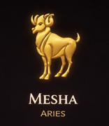

<div align="center">



<br/><br/>


<br/>


<br/>

<p align="center">
  
  
  
  
</p>


</div>

---

# 🕉️ SSP ASTRO — DIVINE COSMIC INTERFACE

> **Goal:** Not a UI. Not a website.
> **An Experience:** Walking inside a golden temple beneath a living, breathing universe.

---

# 🌌 ✨ IMMERSIVE ANIMATION SYSTEM

## 🌠 Infinite Cosmic Background

* Multi-layer parallax starfield
* Smooth drifting animation (`@keyframes cosmic-drift`)
* Subtle glowing nebula overlays
* Depth illusion using blur + opacity transitions

```css
@keyframes cosmic-drift {
  0% { transform: translateY(0); }
  100% { transform: translateY(-2000px); }
}
```

---

## 🪐 Floating Divine Elements

* Icons gently levitate (breathing motion)
* Gold aura pulse effect
* Shadow glow reacts to hover

```css
@keyframes float {
  0%,100% { transform: translateY(0px); }
  50% { transform: translateY(-12px); }
}
```

---

## 🔮 Zodiac Wheel (Next-Level Animation)

* Continuous 360° rotation
* Glow intensifies on hover
* Radial energy beams

```css
@keyframes spin-slow {
  from { transform: rotate(0deg); }
  to { transform: rotate(360deg); }
}
```

---

## ✨ Glassmorphism UI (Premium Feel)

* Frosted cosmic panels
* Backdrop blur + light refraction
* Floating card animations

```css
.card {
  backdrop-filter: blur(20px);
  background: rgba(22,15,42,0.45);
  box-shadow: 0 0 30px rgba(245,201,120,0.2);
}
```

---

## 🚀 Scroll Reveal (Temple Unfold Effect)

* Smooth fade + upward motion
* Triggered via Intersection Observer
* Delayed cascade animations

```js
observer.observe(element);
element.classList.add("reveal-active");
```

---

## 🌟 Energy Pulse Effects

* Buttons emit glowing waves
* Hover triggers aura expansion
* Golden ripple animation

---

# 🎨 DIVINE DESIGN SYSTEM

| Element         | Value                                   | Purpose                    |
| --------------- | --------------------------------------- | -------------------------- |
| 🌟 Primary Gold | `#F5C978`                               | Sacred glow, divine energy |
| 🌌 Deep Space   | `#0A0914`                               | Infinite cosmic background |
| 🔮 Glass Layer  | `rgba(22,15,42,0.45)`                   | Mystical UI                |
| ✨ Accent Glow   | `rgba(245,201,120,0.6)`                 | Aura effects               |
| 🧠 Fonts        | Poppins + El Messiri + Noto Sans Telugu | Spiritual-modern fusion    |

---

# 🧠 EXPERIENCE FLOW

1. 🌌 Enter → Cosmic background fades in
2. 🕉️ Logo floats with divine glow
3. 🔮 Zodiac wheel slowly awakens
4. ✨ Cards appear like temple offerings
5. 🌠 Scroll reveals hidden insights
6. 🌟 Final state → Fully immersive cosmic environment

---

# 🚀 RUN LOCALLY

```bash
git clone https://github.com/Jayakrishnasai/SSP_Astro_Demo.git
cd SSP_Astro_Demo
```

### Start Server

```bash
python -m http.server 8000
```

OR

```bash
npx serve .
```

### Open Portal

```
http://localhost:8000
```

---

# ⚡ FUTURE ENHANCEMENTS (NEXT LEVEL)

* 🌌 Parallax mouse tracking (3D depth)
* 🔮 AI-powered horoscope engine
* 🎧 Background mantra audio toggle
* 🌠 Shooting star interactions
* 🧘 Chakra-based UI themes
* 📿 Personalized kundali dashboard

---

<div align="center">


<br/>

✨ *"Not just code. Not just design. This is an experience of energy."* ✨

🕉️ **SSP Astro — Where Code Meets Cosmos**

</div>
